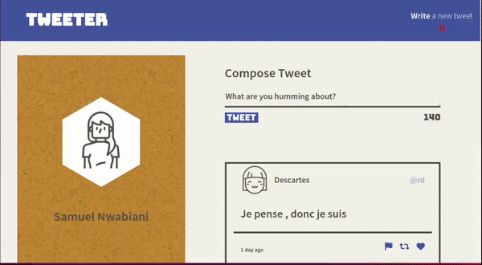
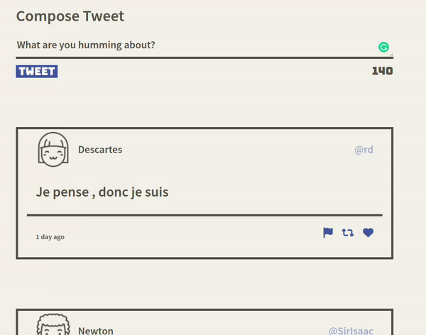

# Tweeter Project

A single-page AJAX-based twitter clone that uses HTML5, CSS3, JS and good old jQuery to pratice my front-end skills.

## Getting Started

1. Clone your repository onto your local device.
2. Install dependencies using the `npm install` command.
3. Start the web server using the `npm run local` command. The app will be served at <http://localhost:8080/>.
4. Go to <http://localhost:8080/> in your browser.

## Final Product

### Tweets

### Tweet box

## Dependencies

- Express
- Node 5.10.x or above
- body-parser
- chance
- md5
